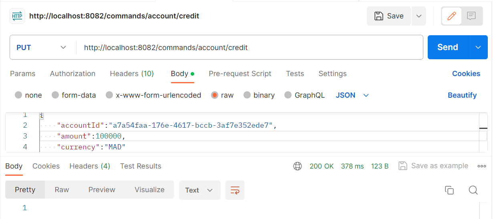

<h1>Event Driven Micro-services Architectures, CQRS & Event Sourcing Patterns : Spring Cloud & AXON Framework</h1>

<h3>Architecture et Terminologie Event Sourcing</h3>
</img>

</img>

<h3>AXON Framework</h3>
</img>

<h3>L'architecture d'Application</h3>
</img>
</img>

<h3>Create Data Base</h3>
</img>
<h2>Testes : </h2>
<h3>Test : Create Account Comand</h3>
</img>
<h3>Test : Credit Account Comand</h3>
</img>
<h3>Test : Debit Account Comand</h3>
</img>
<h2>EventStore Data Base</h2>
<h3>Accounts</h3>
</img>
<h3>Operations</h3>
</img>
<h3>Events</h3>
</img>

